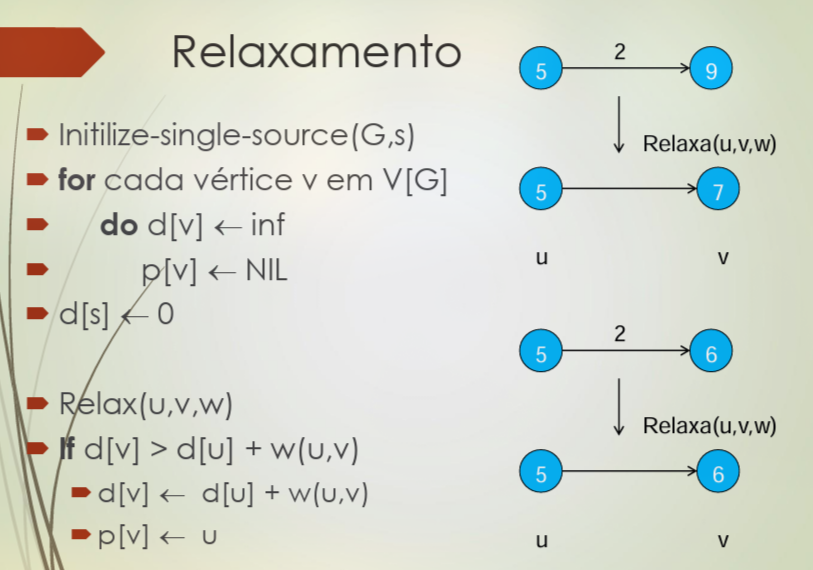
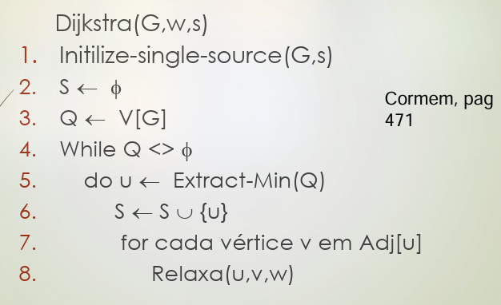
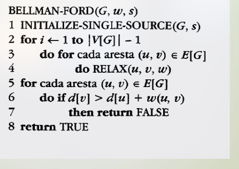

# Caminho-Mínimo

O peso $w$ de um caminho $p$ composto por $k$ arestas entre vértices $v_i$ é definido como a soma dos pesos das arestas que o compõem:
$$
w(p) = \sum_{i=1}^k w(v_{i-1}, v_i)
$$

O peso mínimo do caminho entre $u$ e $v$ é $\delta(u, v) = \text{min}(w(p))$, ou $\infty$ caso o caminho não exista.

⚠️ Subcaminhos de caminhos mínimos também são caminhos mínimos.

## Impressão do Caminho

# Djikstra

* Somente para arestas de pesos positivos.
* Algoritmo de fonte única.

## Relaxamento 

## Algoritmo

* Q é fila de prioridade: $O(n\log n)$

❗Se for em DAG: usar DP em DAG.

# Bellman-Ford

Inclui arestas negativas.

❗O algoritmo devolve um `bool` que indica se há ciclos negativos. Geralmente usado para DAG.

## Algoritmo

Essencialmente, cada iteração aumenta o tamanho do caminho mínimo possível (de $1$ aresta até $|V|-1$). Com $|V|-1$ iterações, garantimos que cobrimos o pior caso: caminho com $|V|-1$ arestas.