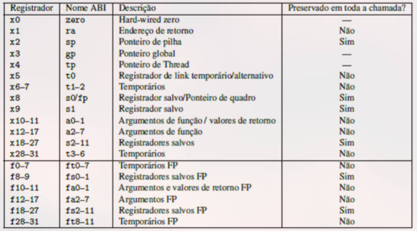
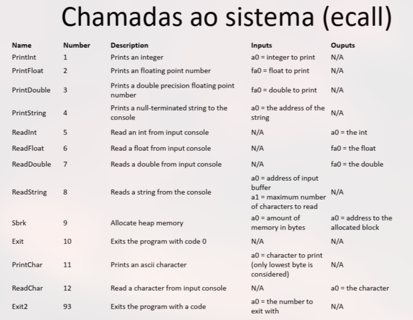

# Assembly RISC-V

## CISC - Complex Instruction Set Computer

> Composto por instruções complexas de tamanho variável que demandam grandes números de ciclos de clock.
* Faz referência a operandos diretamente na memória principal.

⚠️ Essa arquitetura torna difícil a implementação de pipeline.


## RISC - Reduced Istruction Set Computer

> Possui instruções fixas de 32 bits, demandando 1 ciclo de ciclo de clock por instrução (monociclo).
* Operando precisam ser tratados usando registradores.
* Apenas as funções **load** e **store** podem usar a memória principal como operando.


⚠️ Essa arquitetura facilita a implementação de pipeline.

❗O RISC-V surgiu para atender a requisitos variados e trazer mais flexibilidade.
* É endereçado a <u>byte</u>.


## Assembly

> A estrutura do código em Assembly é composta por <u>diretivas</u>, <u>rótulos</u> e <u>ecall</u> (entrada e saída).

### Estrutura da Memória


### Diretivas 

#### Segmento de Dados - $.data$

Este é o espaço para a declaração de variáveis estáticas.

#### Segmento de Texto - $.text$

Este é o espaço reservado para o código fonte, cujo tamanho não vai mudar com a execução do código.

❗Os segmentos são separados por diretivas.

#### Tipagem

Diretivas são usadas para definir tipos de dados.

### Rótulos

Rótulos são usados para realizar controle de fluxo.

### Exemplo de Código

* addi: add immediate
* li: load immediate
* la: load address
```mips
    .data 

string: .asciz "Hello World"


    .text
    .globl main

main: addi a7, zero, 4  # 4 -> a7
    #li a7, 4           # 4 -> a7

    la a0, string       # &string -> a0

    ecall
    addi a7, zero, 10   # 10 -> a7
    ecall
```

Nesse caso, nós imprimos a string contida em `a0`, porque o registrador `a7` continha o valor 4: PrintString.

Após isso, colocamos 10 em `a7`. Note que `10` representa a função `exit` na figura abaixo.





