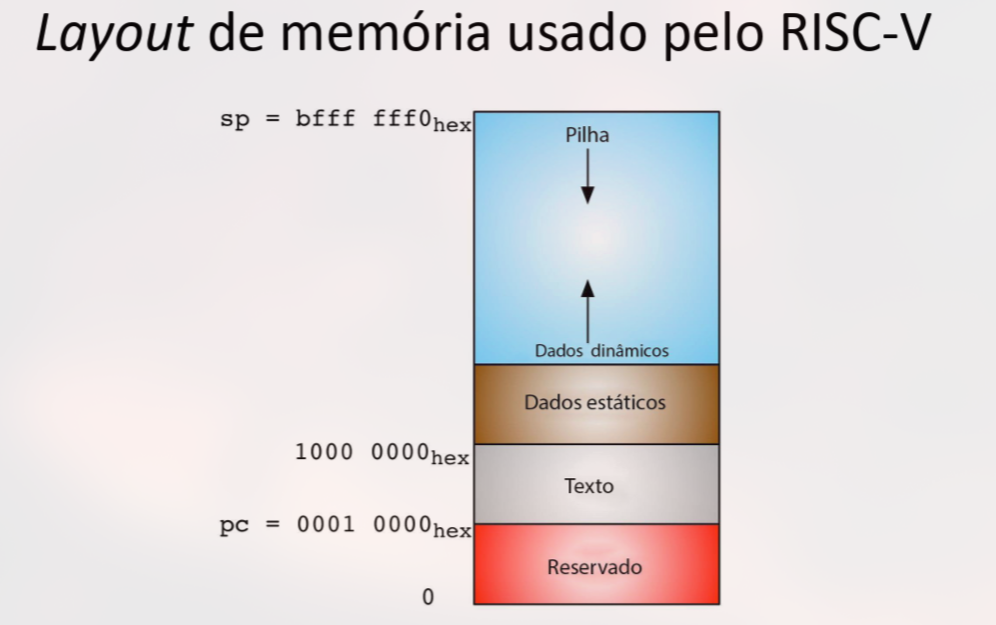

# Assembly RISC-V

## CISC - Complex Instruction Set Computer

> Instruções complexas de tamamho variado que demandam grande número de ciclos de clock. 
* Faz referência a operandos <u>na memória principal</u>.

Essa complexidade da arquitetura CISC torna mais difícil de implementar pipeline.

## RISC - Reduced Instruction Set Computer

> Instruções mais simples com demanda de número fixo de ciclos de clock para a execução dessas instruções. <u>Usa poucos e simples modos de endereçamento</u>.
* Cada fase de processamento da instrução tem a duração **fixa** igual a um ciclo de clock.
* Mais fácil implementar pipeline.

Apenas a funções de **load** e **store** referenciam operandos na memória principal.

## RISC-V
🟢 O RISC-V chegou para ser universal, funcionando bem para uma variedade de requisitos.
* 32 bits - 32 registradores de propósito geral e 32 de ponto flutuante
* Possui memória endereçada a <u>byte</u>.

❗Arquitetura orientada a registrador; todas as operações aritméticas são realizadas entre registradores. Não é possível operar diretamente em valores na memória.

### Assembly

* Estrutura do Código

    1. Rótulos e Diretivas
    2. Chamada ao Sistema para fazer E/S - *ecall*

* Ferramenta de Simulação
    * RARS

#### Estrutura e Diretivas

Segmento de texto (diretiva *.text*) - endereço 0x00010000
* Código fonte
* Espaço reservado

Segmento de dados (diretiva *.data*) - endereço 0x10000000
* Variáveis estáticas

#### Rótulos

> Indicam a natureza de cada linha de código.
 * Estruturas de condição e de repetição, entre outros.

b: branch 
* Branches representam desvios condicionais

#### Prática

Assembly segue a ordem: `nome_variavel: tipo valor` e `rótulo: # código interno`

Diretivas `.data` e `.text` separam a região de código da região de dados. Outras diretivas como `.word` definem tipos de dados.

A diretiva `.globl main` é seguida pelo rótulo `main:` e funciona mesma forma da função `main` do código feito em C.

❗É importante saber o que as diretativas fazem.

#### Chamadas os Sistema

> Principais: `PrintInt`, `PrintString`, `ReadInt` e `ReadString`.

    

