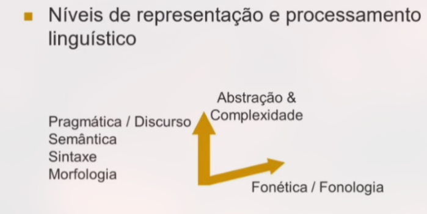

# Disciplina

Processamento de Linguagem Natural é um ramo da Inteligência Artificial.

## História da IA

Versões de IA com o passar do tempo: simbólicas, estatísticas e neurais.

* IA Eliza, Melisa, Stark, Pegasus, Watson, Assistentes Virtuais, ChatGPT

A PLN possui diversos campos.

## IA Generativa

### Sabiá 3
> LLM treinado em dados relevantes ao Brasil (direito, medicina, finanças, etc.)

### LLM conseguem resolver tarefas fora dos seus dados de treino?
1. Em outras palavras, podem fazer generalizações?

    IAs têm conhecimento nível doutor.
    
    IAs com controle de um computador têm o *potencial* de realizar qualquer trabalho intelectual; **agentes para desenvolvimento de software já são uma realidade.**

2. Estamos gerando dados *sintéticos*; já usamos todos os dados humanos.

### Dinheiro gasto no desenvolvimento de IAs

> Leis de Escala dos LLMs

Gastamos dinheiro exponencialmente com treinamentos para crescer linearmente a quantidade de tarefas resolvidas pela IA.
* Essa curva pode ser melhorada (menos dinheiro, mais tarefas) com <u>melhoria de dados, hardware e algoritmos.</u>

> O treino das IAs consiste em múltiplos estágios: pré-treino, expansão de contexto e pós-treino.
* Gastamos mais dinheiro no pré-treino.

#### Pré-treino

Treinamento em 10 trilhões de palavras, com cerca de 2000 GPUs por 2 meses. Além disso, a arquitetura usada (Transformer) usa cerca de 680 bilhões de parâmetros.

❗O gargalo está no cluster de GPUs. Ele custa pelo menos R$ 200 Milhões.
* Requisitos: Milhares de GPUs/TPUs e GPUs/TPUs altamente interconectados (largura de banda alta).
* 1 GWatt é a ordem de grandeza da energia necessária.

### LLM Geral vs Especializada
> Quanto maior a LLM, maior o benefício em especializar em termos computacionais.
* A eficiência pode chegar a 4x maior no modelo especialista.

### Um possível futuro próximo
> Vamos descrever os níveis para a IA Geral

1. Chatbots: conversas normais
2. Racionalizadores: IAs capazes de raciocínio lógico
3. Agentes: capazes de tomar decisõe e realizar ações
4. Inovadores: IAs capazes de inovação; de gerar conhecimento novo
5. Organizações: IAs capazes de fazer tudo que uma organização faz.

#### Organizações
> Este tipo de IA, possivelmente, geraria a maior porção do capital de um país.

### Conclusões
> Precisamos de um aprimoramento da infraestrutura computacional para a nova época da IA.

## A Língua

### Língua *x* Linguagem

* **Linguagem**: capacidade humana de comunicação e suas manifestações, de forma verbal ou não.
    * Envolve o aparato físico e mental/cognitivo.

* **Língua**: código de comunicação utilizado por uma comunidade.

### Estrutura da Língua

### Conhecimento Linguístico

* <u>Superficial *x* Profundo</u>, <u>Simbolismo *x* Estatísticas</u>

> Ideal adotar um sistema híbrido.

#### Chomsky

A Linguagem é (biologicamente) inata.

> Racionalismo e Gerativismo

Córpus

#### Empirismo

> A mente não vem com princípios e procedimentos pré-determinados, mas com operações gerais de associação, reconhecimento de padrões e generalizações.
* Estímulo sensorial se torna essencial para o aprendizado da língua.

### Dualidade Córpus/Instrospecção

> Eric Laporte

## Processamento Linguístico
> Universal Dependencies (UD)

### Sons

#### Fonética

Estuda os sons que os humanos produzem, transmitem e recebem, independente da língua.

#### Fonologia

Estudo dos sons em uma uma língua específica: como os sons são construídos.

### Morfologia

Palavra: construção e componentes de formação.
* Morfema, raiz, afixo, vogal temática, desinência...

### Sintaxe

Une-se à morfologia e dá existência às <u>classes gramaticais</u>.
* Substantivo/nome, verbo, adjetivo, advérbio, pronome...

### Semântica

Palavras, expressões, orações, sentenças, textos... 

Abstrato. 

#### Semântica Lexical

Relações "lexicais": <u>taxonomias</u> e ontologias.
* Sinonímias, antonímia, hiperonomínia/hiponímia...

Classes/categorias/tipos

Função semântica: agente, tema...

Emoções

### Pragmática / Discurso

#### Discurso

O que vai além da sentença.
* "Ele queria jogar tênis com Janete, mas também queria jantar com Suzana. Sua indecisão o deixou louco."

#### Pragmática

Língua em uso. Contexto de uso.

